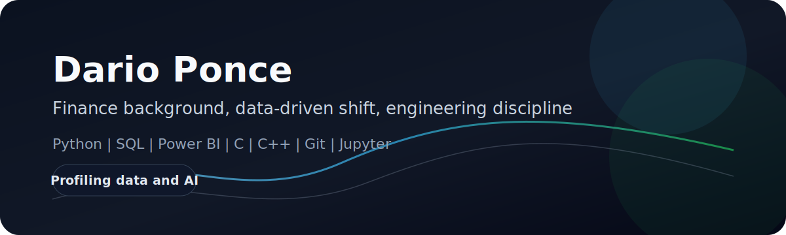
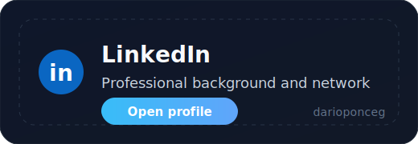
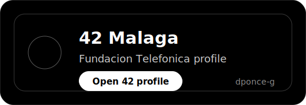

<h1 align="center">
    
</h1>

<table align="center" width="100%">
    <tr>
        <td align="left" width="50%">
            
        </td>
        <td align="right" width="50%">
            
        </td>
    </tr>
</table>

### Fintech mindset. Data-driven shift. Engineering discipline.

I am an analyst by background, reskilling into a hybrid technical profile focused on data and AI. My path combines business understanding with hands-on software skills, with the goal of building systems that are useful, reliable, and measurable.

## About Me

I started in finance, where I developed a strong sense for business context, structure, and decision-making. I am now moving toward data, automation, and AI through the 42 ecosystem and independent technical projects.

My focus is practical: understanding problems deeply, translating them into clear technical solutions, and shipping work that can be tested and improved.

## Skills

    
    
    
    
    
    
    

## Selected Work

- Real-time anomaly detection for renewable energy production.
- Minishell developed within the 42 curriculum.

## 42 Journey

| Stage | Date |
| --- | --- |
| Piscine C | Oct 2024 to Nov 2024 |
| Cursus | Dec 2024 to Present |

## Contact

If you want to reach me, use this email: [darioponceg@gmail.com](mailto:darioponceg@gmail.com)

> Business context first, technical execution second, measurable value always.

<h2 align="center"></h2>

    

